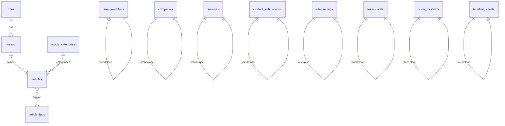

# Database Schema & ERD

## Entity Relationship Overview

## Tables

### users
| Column | Type | Notes |
|--------|------|-------|
| id | bigint PK | |
| role_id | FK → roles | nullable |
| name | string | |
| email | string unique | |
| password | string | hashed |
| is_active | boolean | default true |

### roles
| Column | Type | Notes |
|--------|------|-------|
| id | bigint PK | |
| name | string | |
| slug | string unique | super-admin, admin, editor |

### team_members
| Column | Type | Notes |
|--------|------|-------|
| id | bigint PK | |
| name, slug, designation | string | slug unique |
| photo | string nullable | storage path |
| qualifications, biography | text | |
| linkedin_url, email, phone | string nullable | |
| is_featured, is_leadership | boolean | |
| sort_order | int | |
| is_published | boolean | |

### article_categories
| id, name, slug, description, meta_title, meta_description |

### article_tags
| id, name, slug |

### articles
| Column | Type | Notes |
|--------|------|-------|
| article_category_id | FK nullable | |
| author_id | FK → users nullable | |
| title, slug | string | slug unique |
| excerpt, content | text | |
| featured_image | string nullable | |
| meta_title, meta_description | string nullable | |
| published_at | timestamp nullable | |
| is_published, is_featured | boolean | |
| views_count | int | |

### article_article_tag (pivot)
| article_id, article_tag_id | unique pair |

### companies
| name, slug, logo, description, services, website_url, featured_image, sort_order, is_published |

### services
| title, slug, short_description, icon, hero_image, overview, benefits (JSON), process_steps (JSON), faqs (JSON), meta fields, sort_order, is_published, show_in_nav |

### contact_submissions
| name, email, phone, company, service_interested, message, ip_address, user_agent, status, read_at |

### site_settings
| key unique, value, group, type |

### testimonials
| client_name, client_title, company, content, rating, photo, sort_order, is_published |

### office_locations
| state, city, address, postcode, phone, email, lat/lng, sort_order, is_published |

### timeline_events
| year, title, description, sort_order, is_published |

## Role Permissions

| Capability | Super Admin | Admin | Editor |
|------------|:-----------:|:-----:|:------:|
| Manage articles | ✓ | ✓ | ✓ |
| Manage team | ✓ | ✓ | ✓ |
| Manage companies | ✓ | ✓ | ✓ |
| Delete content | ✓ | ✓ | ✗ |
| Manage services | ✓ | ✓ | ✗ |
| Site settings | ✓ | ✓ | ✗ |
| Manage users | ✓ | ✗ | ✗ |
